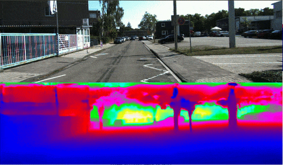

# MonoDepth Prediction

## Training Schedule

```bash
# copy mono depth example config
cd config
cp monodepth_config.py $CONFIG_FILE.py

## Modify config path in nano/vim
nano $CONFIG_FILE.py
cd ..

## train the model
./launcher/train.sh  --config/$CONFIG_FILE.py 0 $experiment_name # validation goes along

## produce validation/test result
./launcher/eval.sh --config/$CONFIG_FILE.py 0 $CHECKPOINT_PATH validation/test
```

## Testing on KITTI
